# Qudi
[](https://www.nuget.org/packages/Qudi/)   &style=flat-square)

**Qudi** (`/kʲɯːdiː/`, Quickly Dependency Injection) is an attribute-based **simple** dependency injection helper library.  
Explicitly, No assembly scan, AOT friendly, and Visualize registrations.
<br/>

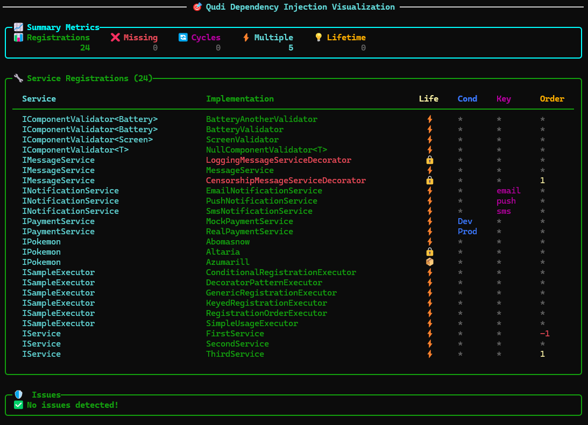

## Getting Started
### First Step
Well, it's easier to show you than to explain it. 😉  
If you are using .NET 10 or later, just paste the following code into a file and run `dotnet file.cs`.

```csharp
#!/usr/bin/env dotnet
#:package Qudi@*
#:package Qudi.Visualizer@*
using Microsoft.Extensions.DependencyInjection;
using Qudi;

var services = new ServiceCollection();

// ✅️ register services marked with Qudi attributes
services.AddQudiServices(conf => {
    // ✅️ enable visualization output to console and file
    conf.EnableVisualizationOutput(option => {
        option.ConsoleOutput = ConsoleDisplay.All;
        option.AddOutput("summary.md");
    });
});

var provider = services.BuildServiceProvider();
var pokemons = provider.GetServices<IPokemon>();
foreach (var pokemon in pokemons)
{
    pokemon.DisplayInfo();
}

// ------ Declare services ------
public interface IPokemon
{
    string Name { get; }
    IEnumerable<string> Types { get; }
    public void DisplayInfo() =>
        Console.WriteLine($"{Name} is a {string.Join("/", Types)} type Pokémon.");
}

[DISingleton] // ✅️ mark as singleton
public class Altaria : IPokemon
{
    public string Name => "Altaria";
    public IEnumerable<string> Types => ["Dragon", "Flying"];
}

[DITransient] // ✅️ mark as transient, too
public class Abomasnow : IPokemon
{
    public string Name => "Abomasnow";
    public IEnumerable<string> Types => ["Grass", "Ice"];
}
```

As you can see, just these two steps. 

1. Mark each class with attributes like `[DISingleton]`, `[DITransient]`, etc.
2. Call `IServiceCollection.AddQudiServices`.

When written like this, the following equivalent code is automatically generated and registered in the DI container:

```csharp
public IServiceCollection AddQudiServices(this IServiceCollection services, Action<QudiConfigurationRootBuilder>? configuration = null)
{
    // Generated code similar to this:
    services.AddSingleton<Altaria>();
    services.AddTransient<Abomasnow>();
    services.AddSingleton<IPokemon, Altaria>(provider => provider.GetRequiredService<Altaria>());
    services.AddTransient<IPokemon, Abomasnow>(provider => provider.GetRequiredService<Abomasnow>());
    return services;
}
```

When you run the application in this state, a simple registration status viewer will be displayed 🎉
<br/>

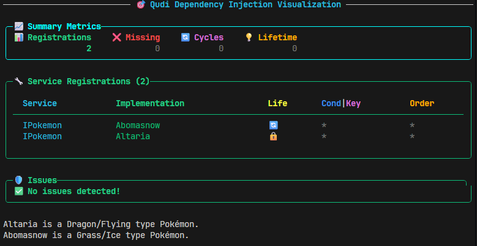

A diagram showing the registration status is also output.

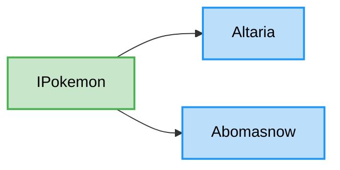

### Analytics
Let's add a class `DisplayPokemonService` to call the registered `IPokemon` together. [Source](./examples/Qudi.Example.Snippets/002_WrongLifetime.cs)

```csharp
[DISingleton] // WARN: this is wrong!
public class DisplayPokemonService(IEnumerable<IPokemon> pokemons)
{
    public void DisplayAll()
    {
        foreach (var pokemon in pokemons)
        {
            pokemon.DisplayInfo();
        }
    }
}
```

Note that it is registered as Singleton (by mistake). If it contains Transient services, it will cause issues with proper disposal.

Let's run the application in this state.

```csharp
var provider = services.BuildServiceProvider();
var displayService = provider.GetRequiredService<DisplayPokemonService>(); 
displayService.DisplayAll();
```

you will see the following warning.

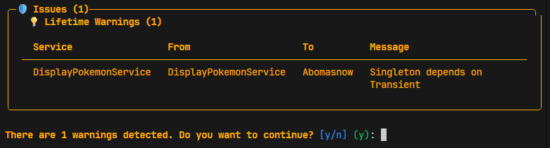

This library has a feature that provides clear [warnings for common mistakes](#registration-status-visualization).
Let's fix it by setting the correct lifetime.  [Source](./examples/Qudi.Example.Snippets/003_CorrectLifetime.cs)

```csharp
[DITransient] // FIX: change to transient
public class DisplayPokemonService(IEnumerable<IPokemon> pokemons)
```

Now, the warning is gone and the application runs successfully 🎉
<br/>

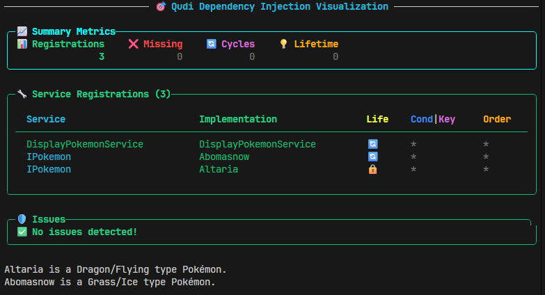

Of course, the diagram will also be updated.

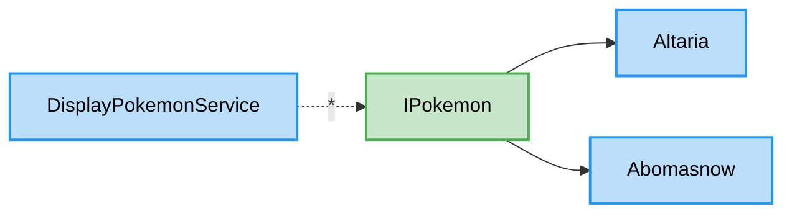

### Decorator and Composite
You can easily implement the Decorator and Composite patterns using Qudi’s features. First, let’s take a look at the Decorator pattern.

A decorator is a design pattern that adds functionality to an existing service without modifying its code.
Here we’ll implement a decorator that adds decorative output before and after console output.
Create a class that accepts `IPokemon` in the constructor and also implements `IPokemon`, like the following. [Source](./examples/Qudi.Example.Snippets/004_Decorator.cs)

```csharp
[QudiDecorator]
public partial class PokemonDecorator(IPokemon decorated) : IPokemon
{
    public void DisplayInfo()
    {
        Console.WriteLine("=== Decorated Pokémon Info ===");
        decorated.DisplayInfo();
        Console.WriteLine("==============================");
    }
    // you don't need to implement Name and Types, they will be auto-implemented by generated code
}
```

When you run this, you will see the following console output.

```
=== Decorated Pokémon Info ===
Altaria is a Dragon/Flying type Pokémon.
==============================
=== Decorated Pokémon Info ===
Abomasnow is a Grass/Ice type Pokémon.
==============================
```

The generated diagram makes it easy to understand what is happening.
That is, the `PokemonDecorator` is registered to be called before and after the actual implementations (`Altaria` and `Abomasnow`) are called.

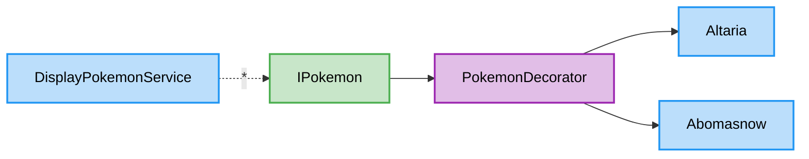

---

`DisplayPokemonService` is just a service that calls `IPokemon.DisplayInfo()` together.
In this case, you want to be able to simply call `IPokemon` without being aware that multiple `IPokemon` are registered from the caller, and have all registered `IPokemon` called just by calling `IPokemon`.
Such a service can be easily implemented using `[QudiComposite]`. [Source](./examples/Qudi.Example.Snippets/005_Composite.cs)

```csharp
var provider = services.BuildServiceProvider();
// ✅️ resolve as IPokemon, not DisplayPokemonService
var displayService = provider.GetRequiredService<IPokemon>();
displayService.DisplayInfo();

[QudiComposite]
public partial class DisplayPokemonService(IEnumerable<IPokemon> pokemons) : IPokemon
{
    // all methods of IPokemon will be implemented
    // to call the corresponding method of each IPokemon in pokemons.
}
```

Note that we are resolving `IPokemon` instead of `DisplayPokemonService` with `RequiredService`.
When you run the application in this state, the result will be as follows.

```bash
=== Decorated Pokémon Info ===
Altaria is a Dragon/Flying type Pokémon.
Abomasnow is a Grass/Ice type Pokémon.
==============================
```

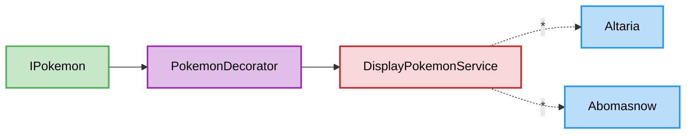

By using `[QudiComposite]`, you can provide multiple implementations together as a single interface.

If you want to control the order, you can specify the order of decorators and composites using the `Order` property. [Source](./examples/Qudi.Example.Snippets/006_Composit_order.cs)

```csharp
[QudiComposite(Order = 0)]
public partial class DisplayPokemonService(IEnumerable<IPokemon> pokemons) : IPokemon { }

[QudiDecorator(Order = 1)]
public partial class PokemonDecorator(IPokemon decorated) : IPokemon
{
    public void DisplayInfo()
    {
        Console.WriteLine("=== Decorated Pokémon Info ===");
        decorated.DisplayInfo();
        Console.WriteLine("==============================");
    }
}
```

In this case, the output will be as follows.

```
=== Decorated Pokémon Info ===
Altaria is a Dragon/Flying type Pokémon.
==============================
=== Decorated Pokémon Info ===
Abomasnow is a Grass/Ice type Pokémon.
==============================
```

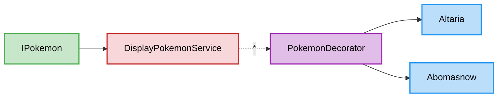


## Installation
Install `Qudi` from NuGet.

```bash
dotnet add package Qudi
```

If you want to use [visualization](#visualize-registration) support (useful during development), install `Qudi.Visualizer`.

```bash
dotnet add package Qudi.Visualizer
```

Alternatively, you can install `Qudi.Core`, `Qudi.Generator` and `Qudi.Container.*` packages separately.

```bash
# install Qudi.Core (common models)
dotnet add package Qudi.Core
# install Qudi.Generator (source generator)
dotnet add package Qudi.Generator
# install container-specific package (here, Microsoft.Extensions.DependencyInjection)
dotnet add package Qudi.Container.Microsoft
```

## Features

* **Basic**
  * [Simple Usage](#simple-usage)
  * [In Multiple Projects](#in-multiple-projects)
  * [Control Registration Order](#control-registration-order)
  * [Keyed Registration](#keyed-registration)
  * [Conditional Registration](#conditional-registration)
* **Advanced**
  * [Generic Registration](#generic-registration)
  * [Decorator Pattern](#decorator-pattern)
  * [Composite Pattern](#composite-pattern)
* **Visualization**
  * [Visualize Registration](#visualize-registration)
* **Customization**
  * [Customize Registration](#customize-registration)
  * [Filtering Registration](#filtering-registration)
  * [Use Collected Information Directly](#use-collected-information-directly)

### Simple Usage
Just mark your classes with the following attributes:
```csharp
using Qudi;

[DISingleton] // mark as singleton
public class YourSingletonService : IService // auto register as IService
{ /* ... */ }

[DITransient] // mark as transient
public class YourTransientService : IService, IOtherService // auto register as IService and IOtherService
{ /* ... */ }

[DIScoped] // mark as scoped
public class YourScopedService // auto register as itself
{ /* ... */ }
```

Then, call `AddQudiServices` in your startup code.

```csharp
services.AddQudiServices();
```

That's it! Your services are now registered in the DI container.

### In Multiple Projects
Dependency Injection is often performed across multiple projects in a solution.  
For example, consider a case where code implemented inside a Core project is used from another project via an interface.

```csharp
// MyApp.Core ----------------
// Shared interface
public interface IDataRepository
{
    Task<MyData> GetDataAsync(int id);
}
// Implementation in MyApp.Core, this class is internal!
internal class SqlDataRepository : IDataRepository
{
    public Task<MyData> GetDataAsync(int id)
    {
        // fetch data from SQL database
    }
}

// MyApp.Web -------------
internal class MyService(IDataRepository repository)
{
    public async Task DoSomethingAsync(int id)
    {
        var data = await repository.GetDataAsync(id);
        // do something with data
    }
}
```

In this case, introduce `Qudi` (or `Qudi.Core`) to `MyApp.Core`.
Next, mark the implementation class and the dependent class with Qudi attributes.

```csharp
// in MyApp.Core
[DISingleton]
internal class SqlDataRepository : IDataRepository { /* ... */ }

// in MyApp.Web
[DITransient]
internal class MyService(IDataRepository repository) { /* ... */ }
```

Then, just call `AddQudiServices` as usual in the startup code of `MyApp.Web`.

```csharp
// in MyApp.Web
services.AddQudiServices();
```

If you don't want to register implementations from other libraries, you can specify it explicitly in `AddQudiServices`.

```csharp
services.AddQudiServices(conf => {
    conf.UseSelfImplementsOnly();
});
```

### Control Registration Order
By default, the registration order is not guaranteed, but you can explicitly control the registration order using the `Order` property.
Default is `0`, and lower values are registered first.

```csharp
[DITransient(Order = -1)]
public class FirstService : IService { /* ... */ }
// This service will be registered first.

[DITransient] // Order=0 by default
public class SecondService : IService { /* ... */ }
// This service will be registered second.

[DITransient(Order = 1)]
public class ThirdService : IService { /* ... */ }
// This service will be registered last.
```

You can use this to provide a default implementation by setting `int.MinValue`.

```csharp
// in MyApp.Core
[DITransient(Order = int.MinValue)]
public class DefaultDataRepository : IDataRepository { /* ... */ }

// in MyApp.Web
[DITransient] // Order=0 by default
public class MyDataRepository : IDataRepository { /* ... */ }
// user can override default implementation by registering later
```

### Keyed Registration
You can also use Keyed registrations by specifying the `Key` parameter in the attribute.

```csharp
[DITransient(Key = "A")]
public class ServiceA : IService { /* ... */ }
```

Then, when resolving the service, specify the key as follows:

```csharp
// from service provider
var serviceA = provider.GetRequiredKeyedService<IService>("A");
// from constructor injection
public class MyComponent([FromKeyedServices("A")] IService service);
```

### Conditional Registration
For example, consider a case where you want to use a mock implementation in the development environment and the actual implementation in the production environment.
In this case, you can specify the environment with attributes as follows.

```csharp
public interface IPaymentService
{
    void ProcessPayment(decimal amount);
}

[DITransient(When = [Condition.Development])]
public class MockPaymentService : IPaymentService
{
    public void ProcessPayment(decimal amount)
    {
        Console.WriteLine($"[Mock] Processed payment of {amount:C}");
    }
}

[DITransient(When = [Condition.Production])]
public class RealPaymentService : IPaymentService
{
    public void ProcessPayment(decimal amount)
    {
        // Actual payment processing logic
    }
}

// you can add customized condition key
// [DITransient(When = ["testing"])]
```

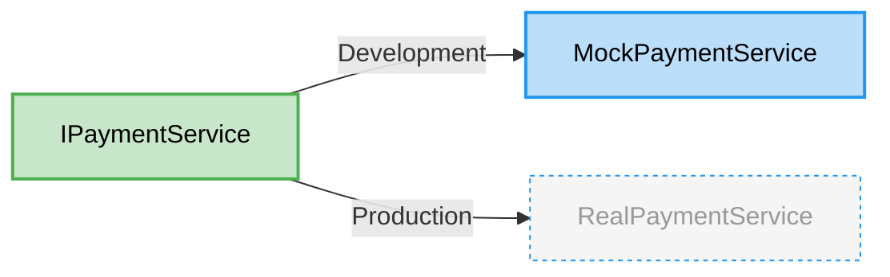

then, specify the rules to apply each condition as an argument of the `AddQudiServices` method.

```csharp
builder.Services.AddQudiServices(conf => {
    // Detection from IHostEnvironment
    conf.SetCondition(builder.Environment.EnvironmentName);
    // Or set it directly
    conf.SetCondition(Condition.Development);
    conf.SetCondition("testing");
    // Alternatively, you can set conditions based on environment variables
    conf.SetConditionFromEnvironment("ASPNETCORE_ENVIRONMENT");
});
```

> [!NOTE]
> If you want to switch processing dynamically according to conditions during runtime, consider using Strategy Pattern or [Feature Flags](https://learn.microsoft.com/en-us/azure/azure-app-configuration/feature-management-dotnet-reference).


### Generic Registration
#### Open Generic Registration
You can register open generic types using Qudi attributes.

```csharp
[DISingleton]
public class GenericRepository<T> : IRepository<T>
{
    public void Add(T entity) { /* ... */ }
    public T Get(int id) { /* ... */ }
}
```

Then, just use it normally in the dependent project.

```csharp
[DISingleton]
public class UserService(IRepository<User> userRepository)
{
    public void CreateUser(User user) => userRepository.Add(user);
}
```

#### Constrained Generic Registration
You can also restrict it to specific interfaces.

```csharp
[DITransient]
public class SpecificGenericService<T> : ISpecificService<T> where T : ISpecificInterface
{
    public void DoSomething(T item) { /* ... */ }
}
```

and you can also register specialized implementations for specific types.  
This allows you to provide a default generic implementation while also providing specialized implementations for specific types.

```csharp
// components
public interface IComponent;
public class Battery : IComponent { /* ... */ }
public class Screen : IComponent { /* ... */ }
public class Keyboard : IComponent { /* ... */ }

// validator
public interface IComponentValidator<T> where T : IComponent
{
    bool Validate(T component);
}

// -----------
// default(fallback) implementation
[DITransient]
public class NullComponentValidator<T> : IComponentValidator<T> where T : IComponent
{
    public bool Validate(T component) => true; // always valid
}

// specialized implementation for Battery
[DITransient]
public class BatteryValidator : IComponentValidator<Battery>
{
    public bool Validate(Battery component) { /* specific validation logic */ }
}

// and for Screen
[DITransient]
public class ScreenValidator : IComponentValidator<Screen>
{
    public bool Validate(Screen component) { /* specific validation logic */ }
}

// -----------
// usage
public class ComponentValidator<T>(IComponentValidator<T> validator) where T : IComponent
{
    public bool Check(T component) => validator.Validate(component);
}
```

If multiple registrations are made for the same type, you can resolve them all by using `IEnumerable<IComponentValidator<T>>` on the usage side.

```csharp
[DITransient]
public class BatteryValidator : IComponentValidator<Battery>
{
    public bool Validate(Battery component) { /* specific validation logic */ }
}

[DITransient]
public class BatteryAnotherValidator : IComponentValidator<Battery>
{
    public bool Validate(Battery component) { /* another validation logic */ }
}

// -----------
// usage
public class ComponentValidator<T>(IEnumerable<IComponentValidator<T>> validators)
    where T : IComponent
{
    public bool Check(T component)
    {
        foreach (var validator in validators)
        {
            if (!validator.Validate(component))
                return false;
        }
        return true;
    }
}
```

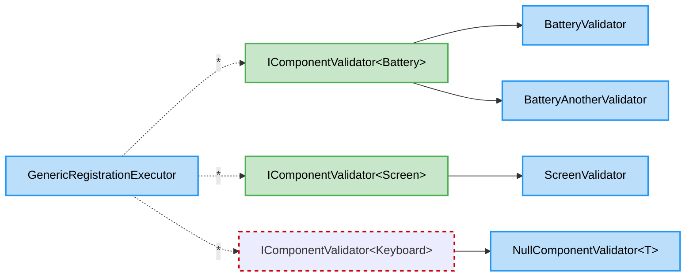

### Decorator Pattern
#### Overview
Decorator pattern is a useful technique to add functionality to existing services without modifying their code.
You can easily register decorator classes using the `[QudiDecorator]` attribute.

```csharp
[QudiDecorator]
public class LoggingMessageServiceDecorator(IMessageService innerService, ILogger<LoggingMessageServiceDecorator> logger)
    : IMessageService
{
    public void SendMessage(string message)
    {
        logger.LogTrace("Sending message: {Message}", message);
        innerService.SendMessage(message);
        logger.LogTrace("Message sent.");
    }
}

[QudiDecorator(Order = 1)] // you can specify order
public class CensorshipMessageServiceDecorator(IMessageService innerService)
    : IMessageService
{
    public void SendMessage(string message)
    {
        var censoredMessage = message.Replace("badword", "***");
        innerService.SendMessage(censoredMessage);
    }
}

// -------------------
[DITransient]
public class MessageService : IMessageService { /* ... */ }

[DITransient]
public class MessageAnotherService : IMessageService { /* ... */ }

public interface IMessageService
{
    void SendMessage(string message);
}
```

```mermaid
flowchart LR
    Qudi_Examples_DecoratorPattern_MessageService["MessageService"]
    Qudi_Examples_DecoratorPattern_IMessageService["IMessageService"]
    Qudi_Examples_DecoratorPattern_LoggingMessageServiceDecorator["LoggingMessageServiceDecorator"]
    Qudi_Examples_DecoratorPattern_CensorshipMessageServiceDecorator["CensorshipMessageServiceDecorator"]
    Microsoft_Extensions_Logging_ILogger_Qudi_Examples_DecoratorPattern_LoggingMessageServiceDecorator_["ILogger#lt;LoggingMessageServiceDecorator#gt;"]
    Qudi_Examples_DecoratorPattern_IMessageService --> Qudi_Examples_DecoratorPattern_LoggingMessageServiceDecorator
    Qudi_Examples_DecoratorPattern_LoggingMessageServiceDecorator --> Qudi_Examples_DecoratorPattern_CensorshipMessageServiceDecorator
    Qudi_Examples_DecoratorPattern_LoggingMessageServiceDecorator --> Microsoft_Extensions_Logging_ILogger_Qudi_Examples_DecoratorPattern_LoggingMessageServiceDecorator_
    Qudi_Examples_DecoratorPattern_CensorshipMessageServiceDecorator --> Qudi_Examples_DecoratorPattern_MessageService
    classDef interface fill:#c8e6c9,stroke:#4caf50,stroke-width:2px,color:#000;
    class Qudi_Examples_DecoratorPattern_IMessageService interface;
    classDef cls fill:#bbdefb,stroke:#2196f3,stroke-width:2px,color:#000;
    class Qudi_Examples_DecoratorPattern_MessageService cls;
    class Qudi_Examples_DecoratorPattern_DecoratorPatternExecutor cls;
    classDef decorator fill:#e1bee7,stroke:#9c27b0,stroke-width:2px,color:#000;
    class Qudi_Examples_DecoratorPattern_LoggingMessageServiceDecorator decorator;
    class Qudi_Examples_DecoratorPattern_CensorshipMessageServiceDecorator decorator;
    classDef external fill:#ffe0b2,stroke:#ff9800,stroke-width:1px,stroke-dasharray:3 3,color:#e65100;
    class Microsoft_Extensions_Logging_ILogger_Qudi_Examples_DecoratorPattern_LoggingMessageServiceDecorator_ external;

```

When you resolve `IMessageService`, the decorators will be applied in the order specified by the `Order` property.

#### Using Auto Implementation
The decorator pattern is useful, but when the target interface has many members, overriding every method becomes tedious.
To solve this, mark the decorator class as `partial` and implement only the methods you need — the remaining methods will be delegated to the auto-generated code.

> [!NOTE]
> This feature uses default interface implementations and therefore requires C# 8 / .NET Core 3.0 or later.

```csharp
// when use QudiDecoratorAttribute, marked partial and implement single interface
[QudiDecorator]
public partial class SampleDecorator(IManyFeatureService innerService, ILogger<SampleDecorator> logger)
    : IManyFeatureService
{
    // Only generate the methods you want to customize
    public void FeatureA()
    {
        logger.LogTrace("Before FeatureA");
        innerService.FeatureA();
        logger.LogTrace("After FeatureA");
    }
    // For other methods, code is automatically generated to simply call innerService.
}

public interface IManyFeatureService
{
    void FeatureA();
    void FeatureB(int val);
    void FeatureC(string msg);
    Task FeatureD(params string[] items);
    // and more...
}
```

<details>
<summary>Generated Code Snippets</summary>

```csharp
// Here, we inherit the auto-generated helper interface that implements the interface automatically.
partial class SampleDecorator : IDecoratorHelper_IManyFeatureService
{
    // implement helper interface by delegating to innerService
    [EditorBrowsable(EditorBrowsableState.Never)]
    IManyFeatureService IDecoratorHelper_IManyFeatureService.__Inner => innerService;
}

[EditorBrowsable(EditorBrowsableState.Never)]
public interface IDecoratorHelper_IManyFeatureService : IManyFeatureService
{
    // Property to access inner service from the interface auto-implementation side
    // The content is implemented in the upper partial class
    IManyFeatureService __Inner { get; }

    // default implementations that delegate to __Inner
    void IService.FeatureA() => __Inner.FeatureA();
    void IService.FeatureB(int val) => __Inner.FeatureB(val);
    void IService.FeatureC(string msg) => __Inner.FeatureC(msg);
    Task IService.FeatureD(params string[] items) => __Inner.FeatureD(items);
    // and more...
}
```

</details>

#### Using Intercept
In addition to overriding individual methods, you can also use the `Intercept` method to perform operations for all method calls at once.
This is useful for logging, performance measurement, and other cross-cutting concerns (AOP-like behavior).

Set the UseIntercept property of the [QudiDecorator] attribute to true to use it.

> [!IMPORTANT]
> Due to implementation constraints (access to the common class via the `Base` property), this feature is only available for decorator classes that implement a single interface.

```csharp
[QudiDecorator(UseIntercept = true)] // enable Intercept method
public partial class SampleInterceptor(IManyFeatureService innerService, ILogger<SampleInterceptor> logger)
    : IManyFeatureService
{
    // you can implement the Intercept method to add common behavior
    public IEnumerable<bool> Intercept(string methodName, object?[] args)
    {
        // before
        Console.WriteLine("Timer started...");
        var start = Stopwatch.GetTimestamp();
        yield return true; // if cancel execution, yield return false;
        // after
        var end = Stopwatch.GetTimestamp();
        var elapsed = (end - start) * 1000 / (double)Stopwatch.Frequency;
        logger.LogDebug("Method {Method} executed in {Elapsed} ms", methodName, elapsed);
    }

    // you can still override specific methods if needed
    public void FeatureA()
    {
        Console.WriteLine("Before FeatureA");
        Base.FeatureA(); // call Base.FeatureA() to use intercept processing
        Console.WriteLine("After FeatureA");
    }
}
```


<details>
<summary>Generated Code Snippets</summary>

```csharp
// Here, we inherit the auto-generated helper interface that implements the interface automatically.
// and also provide access to common processing via the Base property.
partial class SampleDecorator : IDecoratorHelper_IManyFeatureService
{
    // create base implementation instance
    // if you want to call common processing (like Intercept), call innerService via here
    private ISampleDecorator__Generated.__BaseImpl Base => __baseCache ??= new(innerService, this);
    // cache base implementation
    [EditorBrowsable(EditorBrowsableState.Never)]
    private ISampleDecorator__Generated.__BaseImpl? __baseCache;
    // implement base interface by delegating to Base
    [EditorBrowsable(EditorBrowsableState.Never)]
    ISampleDecorator__Generated.__BaseImpl ISampleDecorator__Generated.__Base => Base;
}

[EditorBrowsable(EditorBrowsableState.Never)]
public interface IDecoratorHelper_IManyFeatureService : IManyFeatureService
{
    // Property to access common processing from the interface auto-implementation side
    // The content is implemented in the upper partial class
    protected __BaseImpl __Base { get; }

    // default implementations that delegate to __Base
    void IService.FeatureA() => __Base.FeatureA();
    void IService.FeatureB(int val) => __Base.FeatureB(val);
    void IService.FeatureC(string msg) => __Base.FeatureC(msg);
    Task IService.FeatureD(params string[] items) => __Base.FeatureD(items);
    // and more...

    // intercept hook
    IEnumerable<bool> Intercept(string methodName, object?[] args)
    {
        yield return true; // allow execution by default
    }

    // for common processing implementation
    [EditorBrowsable(EditorBrowsableState.Never)]
    protected class __BaseImpl(IManyFeatureService __Service, IDecoratorHelper_IManyFeatureService __Root)
    {
        public void FeatureA()
        {
            // call intercept hook
            var e = __Root.Intercept("FeatureA", []).GetEnumerator();
            if (e.MoveNext() && e.Current)
            {
                __Service.FeatureA();
                e.MoveNext();
                return;
            }
            throw new InvalidOperationException("Execution of FeatureA was cancelled by Intercept.");
        }

        public void FeatureB(int val)
        {
            var e = __Root.Intercept("FeatureB", [val]).GetEnumerator();
            if (e.MoveNext() && e.Current)
            {
                __Service.FeatureB(val);
                e.MoveNext();
                return;
            }
            throw new InvalidOperationException("Execution of FeatureB was cancelled by Intercept.");
        }

        // and more...
    }
}
```

The generated code creates a helper interface and a base implementation class that handles method delegation and interception logic. The decorator class can then focus on implementing only the methods that require custom behavior, while the rest are automatically handled by the generated code.

</details>

### Composite Pattern
#### Overview
The composite pattern is a design pattern that allows you to treat individual objects and compositions of objects uniformly. You can easily register composite classes using the `[QudiComposite]` attribute.

```csharp
// some message services
[DITransient] 
public class EmailMessageService : IMessageService { /* ... */ }

[DITransient]
public class SmsMessageService : IMessageService { /* ... */ }

// -------------------
// composite service that combines multiple IMessageService implementations
[QudiComposite]
public class CompositeMessageService(IEnumerable<IMessageService> innerServices)
    : IMessageService
{
    // innerServices will automatically contain all registered IMessageService implementations.
    public void SendMessage(string message)
    {
        foreach (var service in innerServices)
        {
            service.SendMessage(message);
        }
    }
}

// usage
[DITransient]
public class MessageSender(IMessageService messageService)
{
    // here, CompositeMessageService will be injected, which automatically applies all IMessageService implementations registered in the container.
    public void Send(string message) => messageService.SendMessage(message);
}
```

#### Combining Decorator and Composite
By combining the decorator pattern and the composite pattern, you can create powerful and flexible service compositions.  
For example, you can create a logging decorator that wraps around a composite service to log messages before and after sending them.

```csharp
[QudiDecorator]
public class LoggingMessageServiceDecorator(IMessageService innerService, ILogger<LoggingMessageServiceDecorator> logger)
    : IMessageService
{
    public void SendMessage(string message)
    {
        logger.LogTrace("Sending message: {Message}", message);
        innerService.SendMessage(message);
    }
}

[QudiComposite]
public class CompositeMessageService(IEnumerable<IMessageService> innerServices)
    : IMessageService
{
    public void SendMessage(string message)
    {
        foreach (var service in innerServices)
        {
            service.SendMessage(message);
        }
    }
}

// In this case,
// MessageSender
// -> LoggingMessageServiceDecorator
// -> CompositeMessageService
// -> [EmailMessageService, SmsMessageService]
```

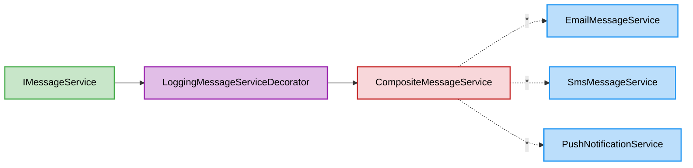

#### Auto Implementation for Composite
you can also use auto implementation for composite classes to avoid boilerplate code when the target interface has many members.
Unlike the decorator pattern, you need to explicitly specify how to handle the results of the combined implementations.

```csharp
[QudiComposite]
public partial class SampleComposite(IEnumerable<ISomeService> innerServices)
    : ISomeService
{
    // in void methods, just execute all implementations
    public partial void FeatureA();

    // in IEnumerable/ICollection methods, combine results and return as a single collection
    public partial IEnumerable<string> FeatureB();

    // in boolean methods, you can specify how to combine results using CompositeMethod attribute
    [CompositeMethod(Result = CompositeResult.All)] // -> return a && b && c && ...;
    [CompositeMethod(Result = CompositeResult.Any)] // -> return a || b || c || ...;
    public partial bool FeatureC();

    // in Task methods, you can also specify how to combine results using CompositeMethod attribute
    [CompositeMethod(Result = CompositeResult.All)] // -> return Task.WhenAll(a,b,c,...);
    [CompositeMethod(Result = CompositeResult.Any)] // -> return Task.WhenAny(a,b,c,...);
    [CompositeMethod(Result = CompositeResult.Forget)] // -> execute all and return completed task immediately without waiting for results;
    public partial Task FeatureD(int val);

    // in other cases, you can use a custom result handler to specify how to combine results.
    [CompositeMethod(ResultHandler = nameof(AggregateEnumValue))] 
    public partial MyEnumValue FeatureE(string msg);

    // such as result.Aggregate((a,b) => AggregateEnumValue(a,b));
    private MyEnumValue AggregateEnumValue(MyEnumValue original, MyEnumValue result)
        => original | result; // example: bitwise OR to combine enum values

    // if you want to handle results manually, you can implement it as a normal method without using auto implementation.
    public void FeatureF()
    {
        // you can also implement methods without using auto implementation,
        // and call inner services manually if you need more control.
    }

    // Behavior for properties is not guaranteed,
    // so it is recommended to implement them manually or avoid using properties.
}
```

## Visualize Registration
### Setup
Qudi collects registration information and generates code.
Therefore, it is possible to visualize the registration status and dependencies based on the collected information.

When visualization is needed, add `Qudi.Visualizer` package to your project.

```bash
dotnet add package Qudi.Visualizer
```

Then, call `EnableVisualizationOutput` in the configuration of `AddQudiServices` to enable visualization output.

```csharp
services.AddQudiServices(conf => {
    conf.EnableVisualizationOutput();
});
```

<details>
<summary> Enable Visualization only for DEBUG Builds </summary>

Since visualization is mainly needed during development, it is recommended to enable it only for DEBUG builds.

```xml
<Project>
  <ItemGroup>
    <PackageReference Include="Qudi.Visualizer" Version="*" Condition="'$(Configuration)' == 'Debug'" />
  </ItemGroup>
</Project>
```
```csharp
services.AddQudiServices(conf => {
#if DEBUG
    conf.EnableVisualizationOutput(option => {
        // customize visualization options here
    });
#endif
});
```

</details>

### Registration Status Visualization
When visualization is enabled, visual runtime errors will be output when there are issues in the registration, such as missing registrations or circular dependencies. This helps you identify and resolve problems in your registration.

#### Missing Registrations
When registrations are missing for interfaces in your project, a visual error like the following is output:

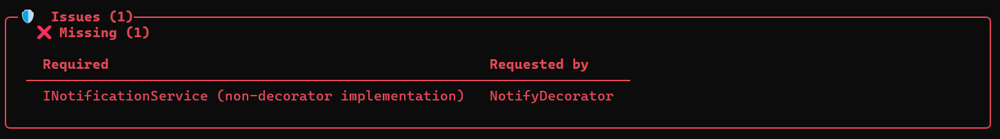

#### Detect Circular Dependencies
When circular dependencies exist in your project, a visual error like the following is output:

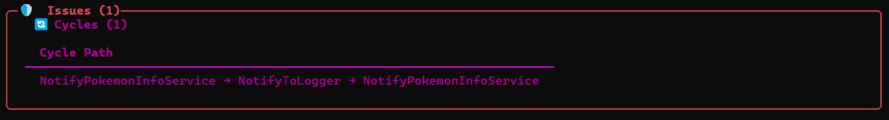

#### Lifetime Warnings
When there are potential lifetime issues in your registrations, such as a singleton depending on a transient service, a warning like the following is output:

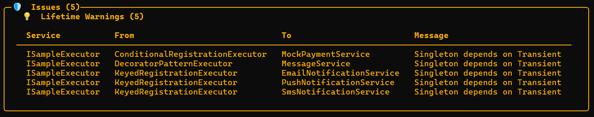

### Customize Output
By default, statistical information and warnings are output. You can specify options as an argument of `EnableVisualizationOutput` to customize it.

```csharp
services.AddQudiServices(conf => {
    conf.EnableVisualizationOutput(option => {
        // Summary + Issues (Default)
        option.ConsoleOutput = ConsoleDisplay.Summary | ConsoleDisplay.Issues;
        // Always output list, even if the count is large
        option.ConsoleOutput = ConsoleDisplay.All;
        // No output to console
        option.ConsoleOutput = ConsoleDisplay.None;
    });
});
```

### Export Registration Diagram
By adding the following call when calling `AddQudiServices`, a diagram showing the registration status will be generated.

```csharp
services.AddQudiServices(conf => {
    conf.EnableVisualizationOutput(option => {
        // Output the registration status of the entire project
        option.AddOutput("assets/output.json");
        option.AddOutput("assets/output.dot");
        option.AddOutput("assets/output.mermaid");
        // or output with `Export=true` to a specific folder
        option.SetOutputDirectory("assets/exported", QudiVisualizationFormat.Markdown);
    });
});
```

Currently, the following outputs are supported.
* Json: Contains detailed information about registrations and dependencies.
* Dot: Can be visualized using Graphviz.
* Mermaid: Useful for quick visualization.
* Markdown: Mermaid format wrapped in Markdown, which can be easily viewed in GitHub, VSCode, etc.
* SVG (requires Graphviz/dot): Converted from DOT format, can be viewed in browsers and image viewers.

By default, the graph of all dependencies of the project is output. For projects other than small ones, it is obviously hard to see, so you can also output starting from a specific class.

```csharp
// specify on attribute side
[DITransient(Export = true)]
public class YourClass : IYourService { /* ... */ }
```

## Customization
### Customize Registration
Are you a customization nerd? You can customize various registration settings using the `[Qudi]` attribute.

```csharp
// For example, you can add custom attributes like this:
[Qudi(
    // Lifetime is required parameter
    Lifetime = Lifetime.Singleton, // or "Singleton"
    // Trigger registration only in specific conditions.
    // if empty, always registered.
    When = [Condition.Development, Condition.Production],
    // It is automatically identified, but you can also specify it explicitly
    AsTypes = [typeof(IYourService), typeof(IYourOtherService)],
    // Make this class accessible from other projects?
    UsePublic = true,
    // You can use Keyed registrations.
    Key = null,
    // Are you concerned about the order of registration? (default is 0, high value means later registration)
    Order = 0,
    // Set true if you want to register as a decorator
    MarkAsDecorator = false,
    // Export visualization data to a specific folder when visualization is enabled. (see Visualize Registration section)
    Export = false
)]
public class YourClass : IYourService, IYourOtherService { /* ... */ }

// [DI*] is just a shorthand for the above [Qudi] attribute, so you can use it like this:
// [DISingleton(When = [Condition.Development], AsTypes = [typeof(IYourService)], ...)]
```

> [!TIP]
> If you need to perform more complex tasks, it is recommended to register them manually.

### Filtering Registration
You can filter which registrations to apply by specifying options in the `AddQudiServices` method.

```csharp
services.AddQudiServices(conf => {
    conf.AddFilter(reg => {
        // e.g. filter by namespace
        return reg.Namespace.Contains("MyApp.Services");
    });
});
```

### Use Collected Information Directly
You can add processing that uses the collected registration information by using `conf.AddService`.

```csharp
services.AddQudiServices(conf => {
    conf
        // customize action for registrations
        .AddService(config => {
            var registrations = config.Registrations;
            foreach (var reg in registrations)
            {
                // e.g. log registration info
                Console.WriteLine($"Registering {reg.Type.FullName}");
            }
        })
        // customize action only work on specific namespace
        // It is pre-filtered before execution and applies root-side filters as well.
        .AddFilter(reg => {
            return reg.Namespace.Contains("MyApp.Services");
        })
        // This service will be applied only in development environment
        .OnlyWorkOnDevelopment();
});
```

You can also refer to the collected information only.

```csharp
using Qudi.Generated;
var registrations = QudiInternalRegistrations.FetchAll();
// registration info like this:
// {
//     Type = typeof(Altaria),
//     Lifetime = "Singleton",
//     When = new List<string> {  },
//     AsTypes = new List<Type> { typeof(IPokemon) },
//     // and so on...
// },
```

## Architecture
This library performs the following tasks internally.

### Collecting class information
First, the source generator scans classes annotated with attributes like `DISingleton` and `DITransient`. Based on the results, it generates code such as the following:

<details>
<summary>Generated Code (Qudi.Registrations.g.cs)</summary>

```csharp
#nullable enable
using System.Linq;

namespace Qudi.Generated
{
    [global::Microsoft.CodeAnalysis.EmbeddedAttribute]
    internal static partial class QudiInternalRegistrations
    {
        public static global::System.Collections.Generic.IReadOnlyList<global::Qudi.TypeRegistrationInfo> FetchAll(bool selfOnly = false)
        {
            var collection = new global::System.Collections.Generic.List<global::Qudi.TypeRegistrationInfo> { };
            if (selfOnly)
            {
                global::Qudi.Generated__4e72f6940c99.QudiRegistrations.Self(
                    collection: collection,
                    fromOther: false
                );
            }
            else
            {
                global::Qudi.Generated__4e72f6940c99.QudiRegistrations.WithDependencies(
                    collection: collection,
                    visited: new global::System.Collections.Generic.HashSet<long> { },
                    fromOther: false
                );
            }
            return collection;
        }
    }
}
namespace Qudi.Generated__4e72f6940c99
{
    /// <summary>
    /// Contains Qudi registration information for this project.
    /// </summary>
    [global::System.ComponentModel.EditorBrowsable(global::System.ComponentModel.EditorBrowsableState.Never)]
    public static partial class QudiRegistrations
    {
        /// <summary>
        /// Gets all registrations including dependencies. This method is used internally for Qudi.
        /// </summary>
        /// <param name="fromOther">Whether to include only public registrations from other projects.</param>
        /// <returns>All registrations including dependencies.</returns>
        public static void WithDependencies(global::System.Collections.Generic.List<global::Qudi.TypeRegistrationInfo> collection, global::System.Collections.Generic.HashSet<long> visited, bool fromOther)
        {
            if (!visited.Add(0x4e72f6940c99)) return;
            Self(collection, fromOther: fromOther);
            global::Qudi.Generated__cee6ef8da00c.QudiRegistrations.WithDependencies(collection, visited, fromOther: true);
        }
        
        /// <summary>
        /// Gets registrations defined in this project only. This method is used internally for Qudi.
        /// </summary>
        /// <param name="fromOther">Whether to include only public registrations from other projects.</param>
        /// <returns>Registrations defined in this project only.</returns>
        public static void Self(global::System.Collections.Generic.List<global::Qudi.TypeRegistrationInfo> collection, bool fromOther = false)
        {
            collection.AddRange(Original.Where(t => t.UsePublic || !fromOther));
        }
        
        /// <summary>
        /// All registrations defined in this project.
        /// </summary>
        private static readonly global::System.Collections.Generic.List<global::Qudi.TypeRegistrationInfo> Original = new global::System.Collections.Generic.List<global::Qudi.TypeRegistrationInfo>
        {
            new global::Qudi.TypeRegistrationInfo
            {
                Type = typeof(global::Qudi.Example.Worker.NotifyToLogger),
                Lifetime = "Singleton",
                When = new global::System.Collections.Generic.List<string> {  },
                RequiredTypes = new global::System.Collections.Generic.List<global::System.Type> { typeof(global::Microsoft.Extensions.Logging.ILogger<global::Qudi.Example.Worker.NotifyToLogger>) },
                AsTypes = new global::System.Collections.Generic.List<global::System.Type> { typeof(global::Qudi.Example.Core.INotificationService) },
                UsePublic = true,
                Key = null,
                Order = 0,
                MarkAsDecorator = false,
                AssemblyName = "Qudi.Example.Worker",
                Namespace = "Qudi.Example.Worker",
            },
        };
    }
}
```

</details>


As shown, information about annotated classes is collected as `TypeRegistrationInfo`. If dependencies exist, those are included automatically. Because this information is DI-container-agnostic, it can be used to support multiple DI containers.

### Invoking registrations for each container
Next, container-specific `AddQudiServices` extension methods are generated.
For example, if Qudi is referenced, an extension for `Microsoft.Extensions.DependencyInjection` is generated:

<details>
<summary>Generated Code (Qudi.AddServices.g.cs)</summary>

```csharp
namespace Qudi;

internal static partial class QudiAddServiceExtensions
{
    public static global::Microsoft.Extensions.DependencyInjection.IServiceCollection AddQudiServices(
        this global::Microsoft.Extensions.DependencyInjection.IServiceCollection services,
        global::System.Action<global::Qudi.QudiConfigurationRootBuilder, global::Qudi.QudiConfigurationBuilder>? configuration
    )
    {
        var multiBuilder = new global::Qudi.QudiConfigurationRootBuilder();
        var builderOfCurrent = new global::Qudi.QudiConfigurationBuilder()
        {
            ConfigurationAction = (config) => global::Qudi.Container.Microsoft.QudiAddServiceToContainer.AddQudiServices(services, config)
        };
        multiBuilder.AddBuilder(builderOfCurrent);
        configuration?.Invoke(multiBuilder, builderOfCurrent);
        global::Qudi.Internal.QudiConfigurationExecutor.ExecuteAll(multiBuilder, global::Qudi.Generated.QudiInternalRegistrations.FetchAll);
        return services;
    }
}
```

</details>

Here, we create a QudiConfigurationRootBuilder, add the DI-container-specific builder (builderOfCurrent) at the end, and then call ExecuteAll for all registered QudiConfigurationBuilder instances together with the auto-generated definition data. This design allows users to apply various extensions using the definition data (for example, Visualize Registration) while ultimately performing the registrations into the DI container.

## Development Guides
### Testing
This project uses [TUnit](https://tunit.dev/) for testing. This ensures that the library works correctly even in AOT environments.

To run tests, simply execute the following command in the root directory:

```bash
# run normal tests
dotnet test
# run AOT tests ( e.g. Windows )
dotnet publish tests/Qudi.Tests/Qudi.Tests.csproj -o ./publish -f net10.0 -r win-x64 && publish\Qudi.Tests.exe 
```
