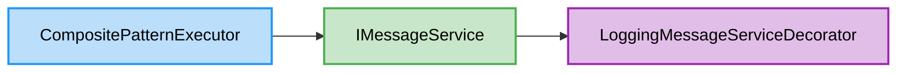

```mermaid
flowchart LR
    Qudi_Examples_CompositePattern_IMessageService["IMessageService"]
    Qudi_Examples_CompositePattern_CompositePatternExecutor["CompositePatternExecutor"]
    Qudi_Examples_CompositePattern_LoggingMessageServiceDecorator["LoggingMessageServiceDecorator"]
    Qudi_Examples_CompositePattern_CompositePatternExecutor --> Qudi_Examples_CompositePattern_IMessageService
    Qudi_Examples_CompositePattern_IMessageService --> Qudi_Examples_CompositePattern_LoggingMessageServiceDecorator
    classDef interface fill:#c8e6c9,stroke:#4caf50,stroke-width:2px,color:#000;
    class Qudi_Examples_CompositePattern_IMessageService interface;
    classDef cls fill:#bbdefb,stroke:#2196f3,stroke-width:2px,color:#000;
    class Qudi_Examples_CompositePattern_CompositePatternExecutor cls;
    classDef decorator fill:#e1bee7,stroke:#9c27b0,stroke-width:2px,color:#000;
    class Qudi_Examples_CompositePattern_LoggingMessageServiceDecorator decorator;

```