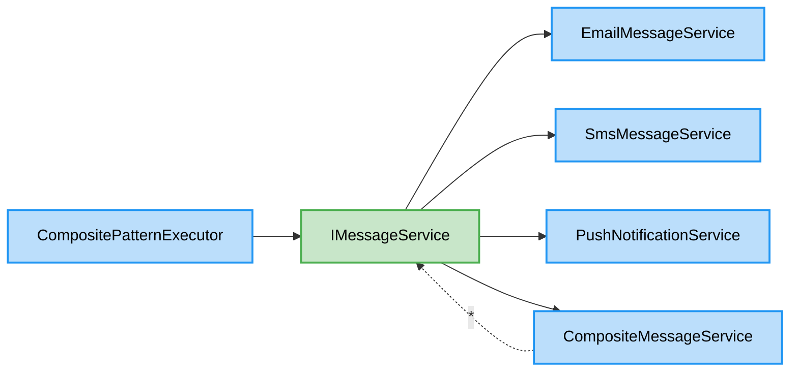

```mermaid
flowchart LR
    Qudi_Examples_CompositePattern_EmailMessageService["EmailMessageService"]
    Qudi_Examples_CompositePattern_IMessageService["IMessageService"]
    Qudi_Examples_CompositePattern_SmsMessageService["SmsMessageService"]
    Qudi_Examples_CompositePattern_PushNotificationService["PushNotificationService"]
    Qudi_Examples_CompositePattern_CompositePatternExecutor["CompositePatternExecutor"]
    Qudi_Examples_CompositePattern_CompositeMessageService["CompositeMessageService"]
    Qudi_Examples_CompositePattern_IMessageService --> Qudi_Examples_CompositePattern_EmailMessageService
    Qudi_Examples_CompositePattern_IMessageService --> Qudi_Examples_CompositePattern_SmsMessageService
    Qudi_Examples_CompositePattern_IMessageService --> Qudi_Examples_CompositePattern_PushNotificationService
    Qudi_Examples_CompositePattern_CompositePatternExecutor --> Qudi_Examples_CompositePattern_IMessageService
    Qudi_Examples_CompositePattern_IMessageService --> Qudi_Examples_CompositePattern_CompositeMessageService
    Qudi_Examples_CompositePattern_CompositeMessageService -.->|"*"| Qudi_Examples_CompositePattern_IMessageService
    classDef interface fill:#c8e6c9,stroke:#4caf50,stroke-width:2px,color:#000;
    class Qudi_Examples_CompositePattern_IMessageService interface;
    classDef cls fill:#bbdefb,stroke:#2196f3,stroke-width:2px,color:#000;
    class Qudi_Examples_CompositePattern_EmailMessageService cls;
    class Qudi_Examples_CompositePattern_SmsMessageService cls;
    class Qudi_Examples_CompositePattern_PushNotificationService cls;
    class Qudi_Examples_CompositePattern_CompositePatternExecutor cls;
    class Qudi_Examples_CompositePattern_CompositeMessageService cls;

```