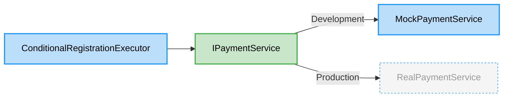

```mermaid
flowchart LR
    Qudi_Examples_ConditionalRegistration_MockPaymentService["MockPaymentService"]
    Qudi_Examples_ConditionalRegistration_IPaymentService["IPaymentService"]
    Qudi_Examples_ConditionalRegistration_RealPaymentService["RealPaymentService"]
    Qudi_Examples_ConditionalRegistration_ConditionalRegistrationExecutor["ConditionalRegistrationExecutor"]
    Qudi_Examples_ConditionalRegistration_IPaymentService -->|Development| Qudi_Examples_ConditionalRegistration_MockPaymentService
    Qudi_Examples_ConditionalRegistration_IPaymentService -->|Production| Qudi_Examples_ConditionalRegistration_RealPaymentService
    Qudi_Examples_ConditionalRegistration_ConditionalRegistrationExecutor --> Qudi_Examples_ConditionalRegistration_IPaymentService
    classDef interface fill:#c8e6c9,stroke:#4caf50,stroke-width:2px,color:#000;
    class Qudi_Examples_ConditionalRegistration_IPaymentService interface;
    classDef cls fill:#bbdefb,stroke:#2196f3,stroke-width:2px,color:#000;
    class Qudi_Examples_ConditionalRegistration_MockPaymentService cls;
    class Qudi_Examples_ConditionalRegistration_ConditionalRegistrationExecutor cls;
    classDef unmatchedCls fill:#f5f5f5,stroke:#2196f3,stroke-width:1px,stroke-dasharray:3 3,color:#999;
    class Qudi_Examples_ConditionalRegistration_RealPaymentService unmatchedCls;

```