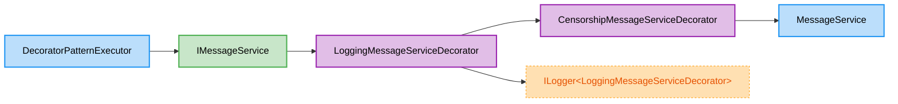

```mermaid
flowchart LR
    Qudi_Examples_DecoratorPattern_MessageService["MessageService"]
    Qudi_Examples_DecoratorPattern_IMessageService["IMessageService"]
    Qudi_Examples_DecoratorPattern_DecoratorPatternExecutor["DecoratorPatternExecutor"]
    Qudi_Examples_DecoratorPattern_LoggingMessageServiceDecorator["LoggingMessageServiceDecorator"]
    Qudi_Examples_DecoratorPattern_CensorshipMessageServiceDecorator["CensorshipMessageServiceDecorator"]
    Microsoft_Extensions_Logging_ILogger_Qudi_Examples_DecoratorPattern_LoggingMessageServiceDecorator_["ILogger#lt;LoggingMessageServiceDecorator#gt;"]
    Qudi_Examples_DecoratorPattern_DecoratorPatternExecutor --> Qudi_Examples_DecoratorPattern_IMessageService
    Qudi_Examples_DecoratorPattern_IMessageService --> Qudi_Examples_DecoratorPattern_LoggingMessageServiceDecorator
    Qudi_Examples_DecoratorPattern_LoggingMessageServiceDecorator --> Qudi_Examples_DecoratorPattern_CensorshipMessageServiceDecorator
    Qudi_Examples_DecoratorPattern_LoggingMessageServiceDecorator --> Microsoft_Extensions_Logging_ILogger_Qudi_Examples_DecoratorPattern_LoggingMessageServiceDecorator_
    Qudi_Examples_DecoratorPattern_CensorshipMessageServiceDecorator --> Qudi_Examples_DecoratorPattern_MessageService
    classDef interface fill:#c8e6c9,stroke:#4caf50,stroke-width:2px,color:#000;
    class Qudi_Examples_DecoratorPattern_IMessageService interface;
    classDef cls fill:#bbdefb,stroke:#2196f3,stroke-width:2px,color:#000;
    class Qudi_Examples_DecoratorPattern_MessageService cls;
    class Qudi_Examples_DecoratorPattern_DecoratorPatternExecutor cls;
    classDef decorator fill:#e1bee7,stroke:#9c27b0,stroke-width:2px,color:#000;
    class Qudi_Examples_DecoratorPattern_LoggingMessageServiceDecorator decorator;
    class Qudi_Examples_DecoratorPattern_CensorshipMessageServiceDecorator decorator;
    classDef external fill:#ffe0b2,stroke:#ff9800,stroke-width:1px,stroke-dasharray:3 3,color:#e65100;
    class Microsoft_Extensions_Logging_ILogger_Qudi_Examples_DecoratorPattern_LoggingMessageServiceDecorator_ external;

```