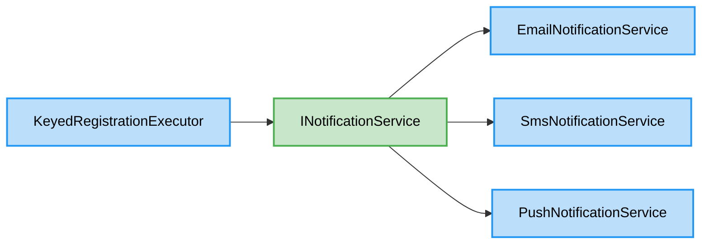

```mermaid
flowchart LR
    Qudi_Examples_KeyedRegistration_KeyedRegistrationExecutor["KeyedRegistrationExecutor"]
    Qudi_Examples_KeyedRegistration_INotificationService["INotificationService"]
    Qudi_Examples_KeyedRegistration_EmailNotificationService["EmailNotificationService"]
    Qudi_Examples_KeyedRegistration_SmsNotificationService["SmsNotificationService"]
    Qudi_Examples_KeyedRegistration_PushNotificationService["PushNotificationService"]
    Qudi_Examples_KeyedRegistration_KeyedRegistrationExecutor --> Qudi_Examples_KeyedRegistration_INotificationService
    Qudi_Examples_KeyedRegistration_INotificationService --> Qudi_Examples_KeyedRegistration_EmailNotificationService
    Qudi_Examples_KeyedRegistration_INotificationService --> Qudi_Examples_KeyedRegistration_SmsNotificationService
    Qudi_Examples_KeyedRegistration_INotificationService --> Qudi_Examples_KeyedRegistration_PushNotificationService
    classDef interface fill:#c8e6c9,stroke:#4caf50,stroke-width:2px,color:#000;
    class Qudi_Examples_KeyedRegistration_INotificationService interface;
    classDef cls fill:#bbdefb,stroke:#2196f3,stroke-width:2px,color:#000;
    class Qudi_Examples_KeyedRegistration_KeyedRegistrationExecutor cls;
    class Qudi_Examples_KeyedRegistration_EmailNotificationService cls;
    class Qudi_Examples_KeyedRegistration_SmsNotificationService cls;
    class Qudi_Examples_KeyedRegistration_PushNotificationService cls;

```