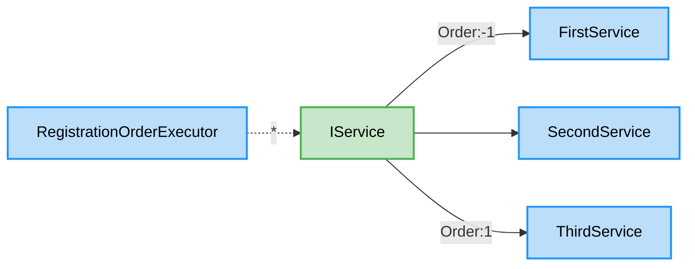

```mermaid
flowchart LR
    Qudi_Examples_RegistrationOrder_FirstService["FirstService"]
    Qudi_Examples_RegistrationOrder_IService["IService"]
    Qudi_Examples_RegistrationOrder_SecondService["SecondService"]
    Qudi_Examples_RegistrationOrder_ThirdService["ThirdService"]
    Qudi_Examples_RegistrationOrder_RegistrationOrderExecutor["RegistrationOrderExecutor"]
    Qudi_Examples_RegistrationOrder_IService -->|Order:-1| Qudi_Examples_RegistrationOrder_FirstService
    Qudi_Examples_RegistrationOrder_IService --> Qudi_Examples_RegistrationOrder_SecondService
    Qudi_Examples_RegistrationOrder_IService -->|Order:1| Qudi_Examples_RegistrationOrder_ThirdService
    Qudi_Examples_RegistrationOrder_RegistrationOrderExecutor -.->|"*"| Qudi_Examples_RegistrationOrder_IService
    classDef interface fill:#c8e6c9,stroke:#4caf50,stroke-width:2px,color:#000;
    class Qudi_Examples_RegistrationOrder_IService interface;
    classDef cls fill:#bbdefb,stroke:#2196f3,stroke-width:2px,color:#000;
    class Qudi_Examples_RegistrationOrder_FirstService cls;
    class Qudi_Examples_RegistrationOrder_SecondService cls;
    class Qudi_Examples_RegistrationOrder_ThirdService cls;
    class Qudi_Examples_RegistrationOrder_RegistrationOrderExecutor cls;

```