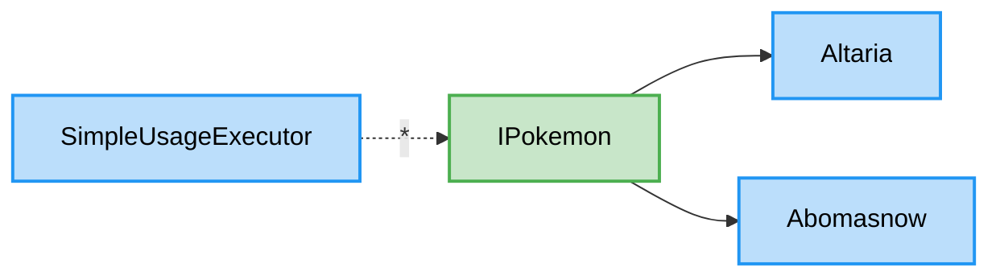

```mermaid
flowchart LR
    Qudi_Examples_SimpleUsage_Altaria["Altaria"]
    Qudi_Examples_SimpleUsage_IPokemon["IPokemon"]
    Qudi_Examples_SimpleUsage_SimpleUsageExecutor["SimpleUsageExecutor"]
    Qudi_Examples_SimpleUsage_Abomasnow["Abomasnow"]
    Qudi_Examples_SimpleUsage_IPokemon --> Qudi_Examples_SimpleUsage_Altaria
    Qudi_Examples_SimpleUsage_SimpleUsageExecutor -.->|"*"| Qudi_Examples_SimpleUsage_IPokemon
    Qudi_Examples_SimpleUsage_IPokemon --> Qudi_Examples_SimpleUsage_Abomasnow
    classDef interface fill:#c8e6c9,stroke:#4caf50,stroke-width:2px,color:#000;
    class Qudi_Examples_SimpleUsage_IPokemon interface;
    classDef cls fill:#bbdefb,stroke:#2196f3,stroke-width:2px,color:#000;
    class Qudi_Examples_SimpleUsage_Altaria cls;
    class Qudi_Examples_SimpleUsage_SimpleUsageExecutor cls;
    class Qudi_Examples_SimpleUsage_Abomasnow cls;

```