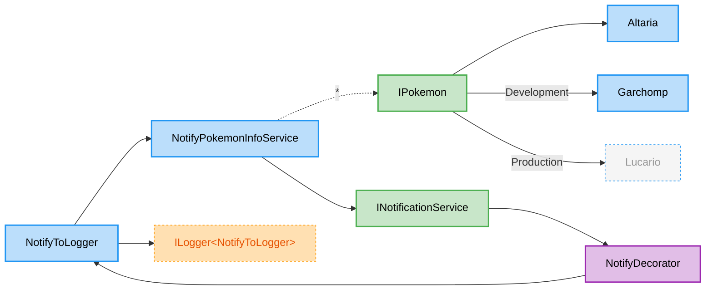

```mermaid
flowchart LR
    Qudi_Example_Worker_NotifyToLogger["NotifyToLogger"]
    Qudi_Example_Core_INotificationService["INotificationService"]
    Qudi_Example_Core_NotifyPokemonInfoService["NotifyPokemonInfoService"]
    Microsoft_Extensions_Logging_ILogger_Qudi_Example_Worker_NotifyToLogger_["ILogger#lt;NotifyToLogger#gt;"]
    Qudi_Example_Core_IPokemon["IPokemon"]
    Qudi_Example_Core_Altaria["Altaria"]
    Qudi_Example_Core_Garchomp["Garchomp"]
    Qudi_Example_Core_Lucario["Lucario"]
    Qudi_Example_Worker_NotifyDecorator["NotifyDecorator"]
    Qudi_Example_Worker_NotifyToLogger --> Qudi_Example_Core_NotifyPokemonInfoService
    Qudi_Example_Worker_NotifyToLogger --> Microsoft_Extensions_Logging_ILogger_Qudi_Example_Worker_NotifyToLogger_
    Qudi_Example_Core_NotifyPokemonInfoService -.->|"*"| Qudi_Example_Core_IPokemon
    Qudi_Example_Core_NotifyPokemonInfoService --> Qudi_Example_Core_INotificationService
    Qudi_Example_Core_IPokemon --> Qudi_Example_Core_Altaria
    Qudi_Example_Core_IPokemon -->|Development| Qudi_Example_Core_Garchomp
    Qudi_Example_Core_IPokemon -->|Production| Qudi_Example_Core_Lucario
    Qudi_Example_Core_INotificationService --> Qudi_Example_Worker_NotifyDecorator
    Qudi_Example_Worker_NotifyDecorator --> Qudi_Example_Worker_NotifyToLogger
    classDef interface fill:#c8e6c9,stroke:#4caf50,stroke-width:2px,color:#000;
    class Qudi_Example_Core_INotificationService interface;
    class Qudi_Example_Core_IPokemon interface;
    classDef cls fill:#bbdefb,stroke:#2196f3,stroke-width:2px,color:#000;
    class Qudi_Example_Worker_NotifyToLogger cls;
    class Qudi_Example_Core_NotifyPokemonInfoService cls;
    class Qudi_Example_Core_Altaria cls;
    class Qudi_Example_Core_Garchomp cls;
    classDef decorator fill:#e1bee7,stroke:#9c27b0,stroke-width:2px,color:#000;
    class Qudi_Example_Worker_NotifyDecorator decorator;
    classDef unmatchedCls fill:#f5f5f5,stroke:#2196f3,stroke-width:1px,stroke-dasharray:3 3,color:#999;
    class Qudi_Example_Core_Lucario unmatchedCls;
    classDef external fill:#ffe0b2,stroke:#ff9800,stroke-width:1px,stroke-dasharray:3 3,color:#e65100;
    class Microsoft_Extensions_Logging_ILogger_Qudi_Example_Worker_NotifyToLogger_ external;

```