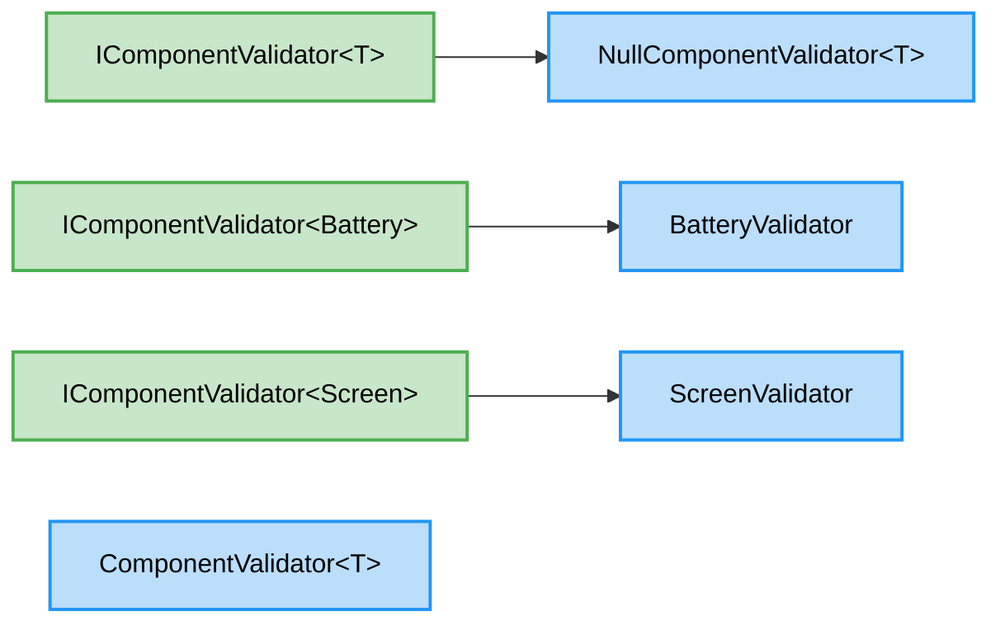

```mermaid
flowchart LR
    NullComponentValidator_T_["NullComponentValidator#lt;T#gt;"]
    IComponentValidator_T_["IComponentValidator#lt;T#gt;"]
    BatteryValidator["BatteryValidator"]
    IComponentValidator_Battery_["IComponentValidator#lt;Battery#gt;"]
    ScreenValidator["ScreenValidator"]
    IComponentValidator_Screen_["IComponentValidator#lt;Screen#gt;"]
    ComponentValidator_T_["ComponentValidator#lt;T#gt;"]
    IComponentValidator_T_ --> NullComponentValidator_T_
    IComponentValidator_Battery_ --> BatteryValidator
    IComponentValidator_Screen_ --> ScreenValidator
    classDef interface fill:#c8e6c9,stroke:#4caf50,stroke-width:2px,color:#000;
    class IComponentValidator_T_ interface;
    class IComponentValidator_Battery_ interface;
    class IComponentValidator_Screen_ interface;
    classDef cls fill:#bbdefb,stroke:#2196f3,stroke-width:2px,color:#000;
    class NullComponentValidator_T_ cls;
    class BatteryValidator cls;
    class ScreenValidator cls;
    class ComponentValidator_T_ cls;

```